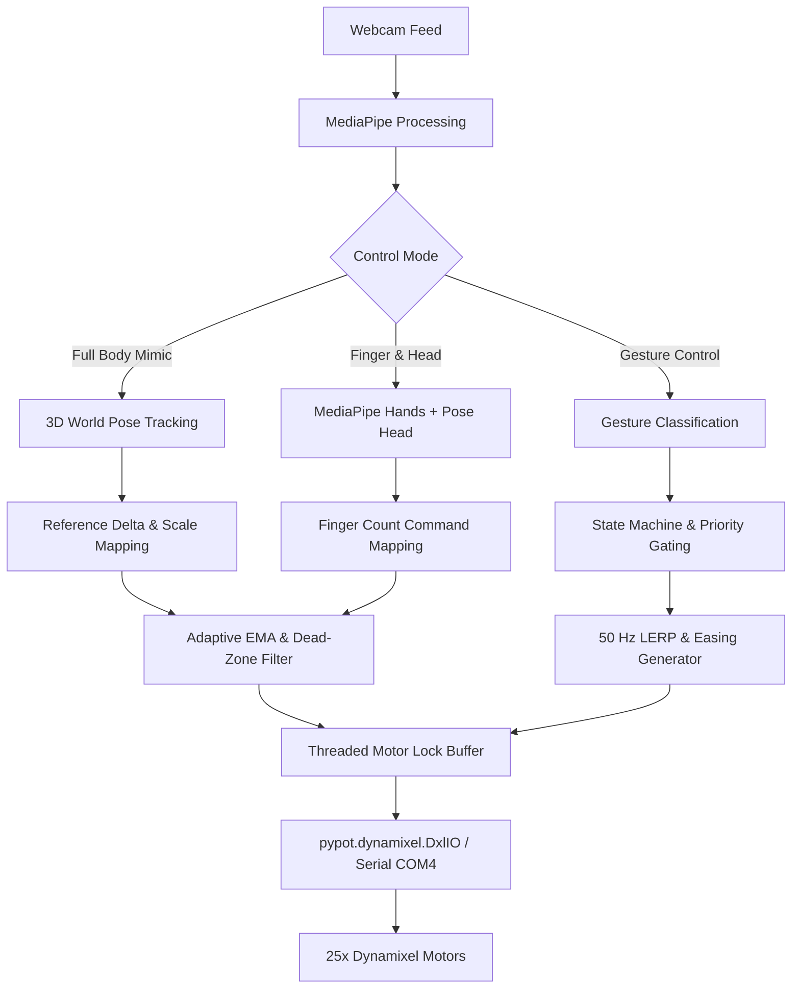

# 🤖 Poppy Humanoid — Real-Time Vision & Gesture Control System

[](https://www.python.org/)
[](https://opencv.org/)
[](https://google.github.io/mediapipe/)
[](https://poppy-project.github.io/pypot/)
[](LICENSE)

An advanced, real-time computer vision control system for the **Poppy Humanoid Robot**. Using a standard webcam, this project maps human pose and hand gestures via Google MediaPipe to drive 25 Dynamixel servomotors with smooth interpolation, adaptive jitter reduction, threaded motor I/O, and gesture state machines.

---

## 🌟 Key Features

- **Full-Body Real-Time Mimicking (v4.1)**: Maps 33 MediaPipe 3D world landmarks to 25 robot motors across the legs, torso, head, and arms in real time.
- **Reference Pose Calibration**: 2-second initial baseline calibration ensures natural zero-delta standing alignment before mimicry begins.
- **Gesture Recognition Engine (v3.0–v9.0)**: Real-time classification of complex gestures (*Wave*, *Salute*, *Hands Up*, *Hands Front*, *Walk Gait*, *Bow*, *Freeze*) with smooth priority-gated transitions.
- **Finger + Head Control (v10.0 FINAL)**: Combines MediaPipe Hands (finger counting for explicit commands) with continuous MediaPipe Pose head tracking.
- **Zero-Jitter Motion Control**:
  - **Adaptive EMA Smoothing**: Dynamic blending factor ($\alpha$) that morphs between high stability when stationary and low latency during rapid movement.
  - **Dynamic Dead-Zone & PoseLock**: Filters out micro-jitters during idle states and freezes motor writes after periods of stability.
  - **VelocityGuard**: Clamps runaway inter-frame angle jumps for hardware safety.
- **Threaded Non-Blocking Motor Architecture**: Camera acquisition loop operates independently at 60 FPS while motor positions update asynchronously over serial bus at ~50–66 Hz.
- **50 Hz LERP & Smooth-Step Easing**: Natural, human-like motion curves during gesture execution and return-to-stand transitions.

---

## 🦾 Hardware & Motor Layout

The control system targets **25 Dynamixel servomotors** connected via USB/U2D2 serial interface on `COM4` operating at `1,000,000` baudrate.

| Section | Motor Count | Motor IDs | Motor Joint Names | Range / Description |
|---|---|---|---|---|
| **Left Leg** | 5 | `11, 12, 13, 14, 15` | `l_hip_x`, `l_hip_z`, `l_hip_y`, `l_knee_y`, `l_ankle_y` | Full leg articulation |
| **Right Leg** | 5 | `21, 22, 23, 24, 25` | `r_hip_x`, `r_hip_z`, `r_hip_y`, `r_knee_y`, `r_ankle_y` | Full leg articulation |
| **Torso** | 5 | `31, 32, 33, 34, 35` | `abs_y`, `abs_x`, `abs_z`, `bust_y`, `bust_x` | Core pitch, roll & yaw |
| **Head** | 2 | `36, 37` | `head_z`, `head_y` | Continuous head tilt/pan |
| **Left Arm** | 4 | `41, 42, 43, 44` | `l_shoulder_y`, `l_shoulder_x`, `l_arm_z`, `l_elbow_y` | Shoulder flexion, raise, roll & elbow |
| **Right Arm** | 4 | `51, 52, 53, 54` | `r_shoulder_y`, `r_shoulder_x`, `r_arm_z`, `r_elbow_y` | Shoulder flexion, raise, roll & elbow |
| **TOTAL** | **25 Motors** | — | — | **Full Humanoid Control** |

---

## 🏗️ System Architecture



---

## 📁 Repository & System Iterations

All versions are documented and executable within [`poppy-humanoid.ipynb`](poppy-humanoid.ipynb):

| Version / Cell | System Name | Key Capabilities |
|---|---|---|
| **Cells 1–7** | Environment & Motor Tests | MediaPipe verification, DxlIO connection, single-motor fist response, and basic right arm control. |
| **Cell 8** | Hand-Tracking Arm Follow | Palm center anchor tracking, adaptive EMA, threaded motor writer, HUD live readouts. |
| **Cell 10** | Production Full-Body Mimic v3.1 | Initial 25-motor mapping across legs, torso, head, and arms with live keyboard scaling. |
| **Cell 11** | Zero-Jitter Mimic v4.0 | Introduced `MotionDetector`, `AdaptiveEMA`, `DynamicDeadZone`, `PoseLock`, and `VelocityGuard`. |
| **Cell 12** | Reference Pose Mimic v4.1 | Added **Reference Pose Calibration** (2s baseline zero-delta stand calibration). |
| **Cells 13–20**| Gesture Control Engine v3.0–v8.0 | Modular `GestureDetector` + `MotionController`, walk keyframe cycle, LERP easing, priority gating. |
| **Cell 22** | Gesture Control v9.0 | Combined MediaPipe Pose gestures + dual thumbs-up gesture reset via MediaPipe Hands. |
| **Cell 23** | Finger + Head Control v10.0 (FINAL) | **Finger Command Mode** (Fist, 1-Finger, Peace, 3, 4, Open Palm, 8) + continuous head tracking. |

---

## ⚙️ Installation & Setup

### Prerequisites
- Python 3.8+
- USB Webcam
- Poppy Humanoid Robot connected via USB / U2D2 adapter (`COM4` by default)

### Dependencies
Install the required packages:

```bash
pip install opencv-python mediapipe numpy pypot pyserial
```

---

## 🚀 Usage

1. **Connect Hardware**: Plug in the Poppy Humanoid USB adapter (`COM4`) and power on the Dynamixel motors.
2. **Launch Notebook**: Open `poppy-humanoid.ipynb` in Jupyter Notebook or VS Code.
3. **Run Control Mode**:
   - For **Full-Body Mimicry**, run **Cell 12 (v4.1)**. Stand 2–3 meters back from the webcam during the 2-second calibration countdown.
   - For **Finger + Head Control**, run **Cell 23 (v10.0 FINAL)**. Show hand gestures ~0.5–1.0 meter from camera.

---

## ⌨️ Live Controls & Keybindings

### Interactive Hotkeys (Mimic & Gesture Modes)

| Key | Action |
|---|---|
| `ESC` / `Q` | Graceful Shutdown (returns robot to safe `STAND_POSE` and disables torque) |
| `SPACE` | Manual Motion Freeze toggle |
| `+` / `=` | Increase movement scale |
| `-` | Decrease movement scale |
| `R` | Re-trigger soft-start calibration sequence |
| `D` | Toggle HUD debug overlay |
| `S` | Force immediate Return-to-Stand |
| `W` | Toggle Walk keyframe gait cycle |

### Finger Command Mapping (v10.0 FINAL)

| Gesture / Finger Count | Robot Action |
|---|---|
| `0` (Fist) | Force immediate return to **Balanced Stand** |
| `1` (Index Up) | Right Wave |
| `2` (Peace Sign) | Left Wave |
| `3` (Three Fingers) | Hands Up |
| `4` (Four Fingers) | Hands Front |
| `5` (Open Palm) | Walk Gait Cycle |
| `8` (Eight / Sub gesture) | Salute |
| *Head Movement* | Continuous head tilt/pan when no finger command is active |

---

## 📄 License

This project is open-source under the [MIT License](LICENSE).

---

## 🙏 Acknowledgments

- **Poppy Project / Flowers Lab (Inria)** for the Poppy Humanoid Robot framework and [`pypot`](https://poppy-project.github.io/pypot/) library.
- **Google MediaPipe** for real-time body pose and hand tracking.
- **OpenCV** for real-time computer vision processing.
